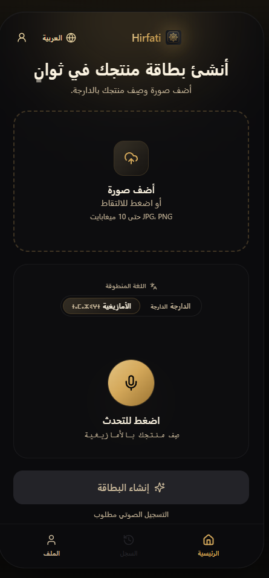
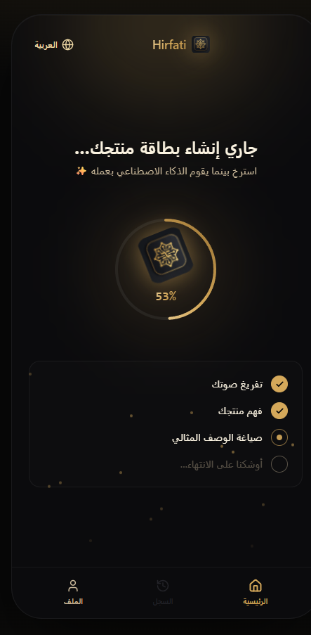
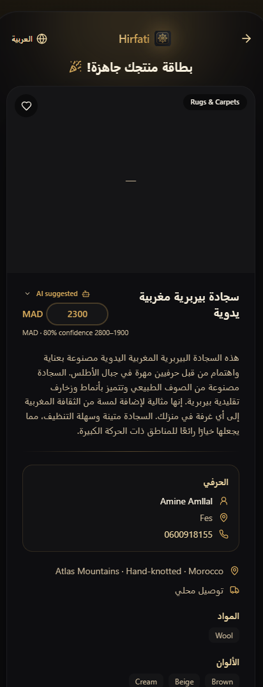

# 🧶 Hirfati — Artisan Listing Studio

Turn a **product photo** + a **voice note in Darija or Tamazight (Amazigh)**
into a **rich multilingual e-commerce listing** (EN/FR/AR title & description,
price in MAD + USD, materials, dimensions, origin, SEO tags) — instantly.

> Built for Moroccan artisans who make world-class goods but don't speak
> English or know e-commerce. Speak in your language → Generate → sell globally.

---

## 📸 Screenshots

<table>
  <tr>
    <th>Home</th>
    <th>Processing audio</th>
    <th>Generated listing</th>
  </tr>
  <tr>
    <td></td>
    <td></td>
    <td></td>
  </tr>
</table>

## ✨ What it does

```
Photo  ┐
       ├─► Darija OR Amazigh STT ─► Groq Llama-4-Scout ─► validated Product ─► premium UI
Voice  ┘   (user-selected lang)     ↓ llama-3.3-70b fallback   ↓ AI price recommendation
                                    (failures surface as clear errors)
```

- **Speech-to-Text (multi-lingual):**
  - Darija via `atlasia/MoulSot.v0.3`
  - Amazigh / Tamazight via `Tamazight-NLP/ASR`
  - User picks the spoken language with a segmented control above the mic
    (persisted in `localStorage`); choice flows through the API
    (`speech_lang`) to route audio to the right Gradio Space
- **LLM extraction:** Groq `meta-llama/llama-4-scout-17b-16e-instruct`
  (primary), `llama-3.3-70b-versatile` (fallback), strict JSON + retry
- **AI price recommendation:** when the artisan does **not** speak a price,
  the backend pulls comparable published listings from Supabase (3-level
  fallback: category + materials → category → any published), scores them
  (`2×material_overlap + colors_overlap + 0.5×tag_overlap + dimension_similarity`),
  and asks Groq to estimate a fair MAD price as a Moroccan handicraft
  expert. Returns suggested / min / max / confidence / reasoning, shown
  in the UI with an "AI suggested" badge and a collapsible reasoning panel.
- **Anti-hallucination guard:** the LLM must set `price_mentioned=true` only
  when the transcript contains an explicit number **and** a currency word
  (درهم / dirham / MAD / euro / dollar / دولار). Otherwise the orchestrator
  triggers the recommendation flow instead of trusting a fabricated price.
- **i18n UI:** EN / FR / AR
- **MCP server:** same capabilities exposed to any MCP agent
- **Observability:** pipeline-stage logs and explicit ASR timeouts so
  cold-start hangs surface as timeouts instead of silent 100% spinners
- **No silent fallbacks:** any STT/LLM failure raises a clear error
  instead of fabricating a listing

## 🗂 Structure

```
apps/
  backend/    FastAPI + shared services + MCP server
  frontend/   Next.js 14 + TS + Tailwind (dark Vercel/Stripe UI)
packages/
  shared-types/  TS + JSON schema (single contract source)
docs/         ARCHITECTURE.md · MCP.md
scripts/      test_env.py
```

---

## 🚀 Setup

### 0. Prereqs

Python 3.10+, Node 18+, a microphone, a Groq API key and a Hugging Face
token (both free tiers work).

### 1. Configure secrets

```bash
cp .env.example .env      # then fill GROQ_API_KEY + HF_TOKEN
```

| Variable       | Required | Notes                          |
| -------------- | -------- | ------------------------------ |
| `GROQ_API_KEY` | yes      | LLM extraction (Groq)          |
| `HF_TOKEN`     | yes      | MoulSot Space (Darija STT) auth |

ffmpeg is **not** required system-wide — a binary is bundled via
`imageio-ffmpeg`.

### 2. Backend

```bash
cd apps/backend
python -m venv .venv
# Windows: .venv\Scripts\activate   |   macOS/Linux: source .venv/bin/activate
pip install -r requirements.txt
uvicorn app.main:app --reload --port 8000
```

Check: <http://localhost:8000/api/health> · Docs: <http://localhost:8000/docs>

### 3. Frontend

```bash
cd apps/frontend
cp .env.local.example .env.local
npm install
npm run dev
```

Open <http://localhost:3000>.

### 4. MCP server (optional)

```bash
cd apps/backend
python mcp_server.py        # stdio — see docs/MCP.md to register
```

---

## 🧪 API examples

```bash
# Health
curl http://localhost:8000/api/health

# Text-only generation (no audio needed)
curl -X POST http://localhost:8000/api/generate \
  -H "Content-Type: application/json" \
  -d '{"transcription":"zarbya soof tabi3i hamra kbira khdmtha b yeddi"}'

# Full pipeline
curl -X POST http://localhost:8000/api/process \
  -F "audio=@voice.wav" -F "image=@rug.jpg"
```

Validated response shape:

```json
{
  "product_title": "Handwoven Atlas Berber Wool Rug — Crimson & Honey",
  "marketing_description": "Knotted by hand in the Atlas foothills…",
  "features": ["100% natural sheep wool", "Hand-knotted", "..."],
  "suggested_price_usd": "$420 - $560",
  "seo_tags": ["berber rug", "moroccan rug", "..."]
}
```

## 🔌 MCP

A real MCP server (tools / resources / prompts) reusing the same pipeline.
See [docs/MCP.md](docs/MCP.md). Tools: `transcribe_audio`,
`generate_product_listing`, `process_artisan_product`.

## 🧷 Tests

```bash
cd apps/backend
pytest -q
```

Covers file validation, JSON sanitization, and schema enforcement.

## 🛟 Troubleshooting

| Problem                       | Fix                                                  |
| ----------------------------- | ---------------------------------------------------- |
| Backend unreachable from UI   | Backend must run on `:8000`; check CORS origin       |
| `GROQ_API_KEY` missing        | Set it in `.env` — extraction won't run without it   |
| Mic not working               | Use Chrome, allow mic permission                     |
| MoulSot down / no token       | Clear error shown — set `HF_TOKEN`, retry            |
| Garbled LLM JSON              | Auto sanitize + retry → fallback model               |
| `pip install` fails on Win    | Upgrade pip; ensure Python 3.10+                     |

## 📣 Social publication (in progress)

We're building **one-click auto-posting to Facebook** so a generated listing
can go from the studio straight to an artisan's Facebook page. The work
lives on the [`social_publication`](https://github.com/Abderrazakkhalil/HackAI_CLoverV/tree/social_publication)
branch — check it out for the Facebook Graph API integration, OAuth flow,
and post-composition logic. Pull and run that branch to try the feature
before it lands on `main`.

```bash
git fetch origin
git checkout social_publication
```

## 🔭 Future improvements

- Vision model to read the photo (not just a filename hint)
- One-click export to Etsy/Shopify
- Streaming generation for sub-second perceived latency
- Multi-product batch mode, Docker compose
- More STT languages beyond Darija + Amazigh

---

Architecture rationale & trade-offs: [docs/ARCHITECTURE.md](docs/ARCHITECTURE.md).
