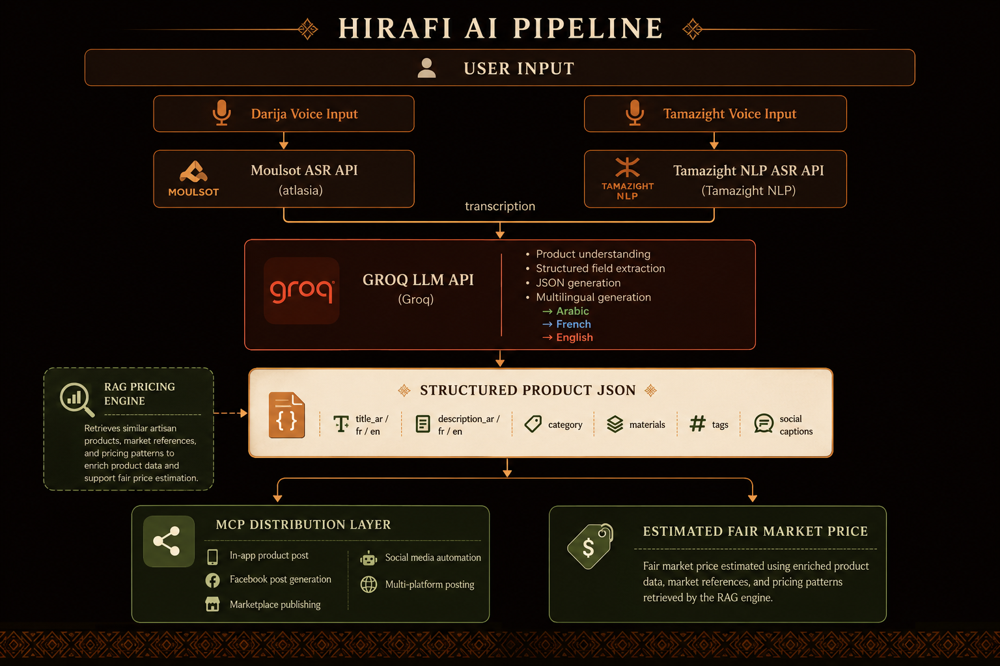
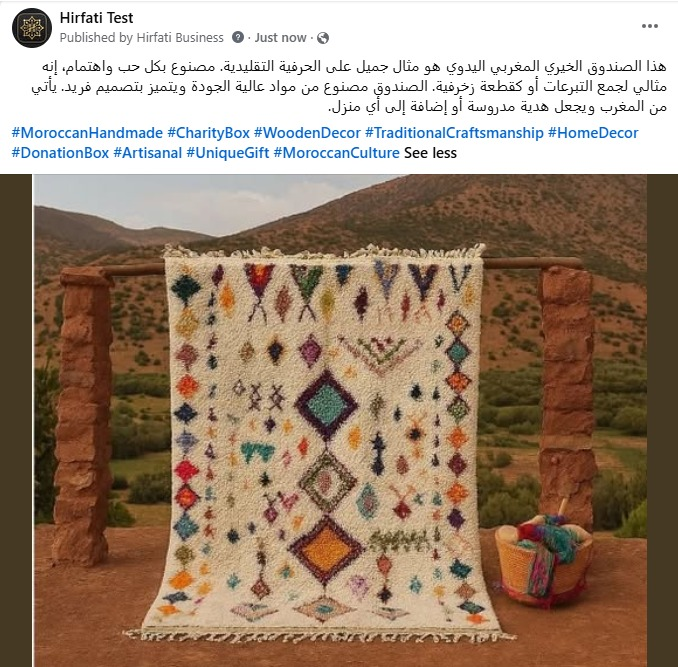

<p align="center">
  <strong style="font-size: 1.75rem; letter-spacing: 0.04em;">Hirfati</strong><br/>
  <em>Artisan Listing Studio — speak in Darija or Tamazight, sell globally</em>
</p>

<p align="center">
  <a href="https://github.com/Abderrazakkhalil/HackAI_CLoverV"></a>
  <a href="https://github.com/Abderrazakkhalil/HackAI_CLoverV"></a>
  <a href="https://github.com/Abderrazakkhalil/HackAI_CLoverV"></a>
  <a href="https://github.com/Abderrazakkhalil/HackAI_CLoverV"></a>
  <a href="https://github.com/Abderrazakkhalil/HackAI_CLoverV"></a>
</p>

<p align="center">
  Turn a <strong>product photo</strong> and a <strong>voice note in Darija or Tamazight</strong> into a
  <strong>rich multilingual e-commerce listing</strong> — EN / FR / AR titles and descriptions,
  fair price in MAD + USD, materials, dimensions, origin, and SEO tags — in seconds.
</p>

<p align="center">
  Built for Moroccan artisans who craft world-class goods but don't speak English or know e-commerce.<br/>
  <strong>Speak in your language → Generate → sell globally.</strong>
</p>

---

## AI Pipeline

End-to-end flow from voice input to structured listings, RAG pricing, and multi-platform distribution.

<p align="center">
  
</p>

<p align="center">
  <sub><em>Darija & Tamazight speech recognition → Groq extraction → structured JSON → RAG fair-price engine → MCP & social distribution</em></sub>
</p>

---

## Highlights

| | |
| --- | --- |
| **Multilingual speech** | Darija via `atlasia/MoulSot.v0.3` · Amazigh via `Tamazight-NLP/ASR` — user picks language before recording |
| **LLM extraction** | Groq `llama-4-scout-17b` (primary), `llama-3.3-70b` fallback — strict JSON, validate, retry |
| **Fair pricing** | RAG over Supabase listings when no price is spoken — scored comparables + expert MAD estimate |
| **Anti-hallucination** | `price_mentioned` only when transcript has a number **and** currency word (درهم / MAD / euro / …) |
| **Premium UI** | Next.js 14 · dark charcoal + gold · EN / FR / AR with RTL for Arabic |
| **Agent-ready** | Same pipeline exposed via MCP tools for any compatible agent |
| **Observable** | Stage-level logs and explicit ASR timeouts — no silent 100% spinners |

---

## Screenshots

<table>
  <tr>
    <th align="center">Home</th>
    <th align="center">Processing audio</th>
    <th align="center">Generated listing</th>
  </tr>
  <tr>
    <td align="center"></td>
    <td align="center"></td>
    <td align="center"></td>
  </tr>
</table>

---

## How it works

```
Photo  ┐
       ├─► Darija OR Amazigh STT ─► Groq Llama-4-Scout ─► validated Product ─► premium UI
Voice  ┘   (user-selected lang)     ↓ llama-3.3-70b fallback   ↓ AI price recommendation
                                    (failures → clear errors, never fabricated listings)
```

**Speech-to-text routing** — segmented control above the mic (persisted in `localStorage`) sends `speech_lang` to the API so audio hits the correct Gradio Space.

**AI price recommendation** — when the artisan doesn't state a price, the backend queries comparable published listings (category + materials → category → any published), scores overlap, and asks Groq for a fair MAD range with confidence and reasoning (shown with an “AI suggested” badge).

**No silent fallbacks** — STT or LLM failures raise typed errors; the pipeline never substitutes fake data.

---

## Project structure

```
apps/
  backend/    FastAPI · shared services · MCP server
  frontend/   Next.js 14 · TypeScript · Tailwind (charcoal + gold UI)
packages/
  shared-types/   TypeScript + JSON schema — single contract source
docs/             ARCHITECTURE.md · MCP.md · screenshots/
scripts/          test_env.py
```

---

## Quick start

### Prerequisites

Python 3.10+, Node 18+, a microphone, a [Groq](https://console.groq.com/) API key, and a [Hugging Face](https://huggingface.co/settings/tokens) token (free tiers work).

### 1 · Configure secrets

```bash
cp .env.example .env
# Set GROQ_API_KEY and HF_TOKEN
```

| Variable | Required | Purpose |
| --- | :---: | --- |
| `GROQ_API_KEY` | yes | LLM extraction |
| `HF_TOKEN` | yes | MoulSot Darija STT (Gradio Space auth) |

> ffmpeg is bundled via `imageio-ffmpeg` — no system install needed.

### 2 · Backend

```bash
cd apps/backend
python -m venv .venv
# Windows:  .venv\Scripts\activate
# macOS/Linux:  source .venv/bin/activate
pip install -r requirements.txt
uvicorn app.main:app --reload --port 8000
```

Health: [localhost:8000/api/health](http://localhost:8000/api/health) · API docs: [localhost:8000/docs](http://localhost:8000/docs)

### 3 · Frontend

```bash
cd apps/frontend
cp .env.local.example .env.local
npm install
npm run dev
```

Open [localhost:3000](http://localhost:3000).

### 4 · MCP server (optional)

```bash
cd apps/backend
python mcp_server.py
```

Register in your MCP client — see [docs/MCP.md](docs/MCP.md).

---

## API

```bash
# Health
curl http://localhost:8000/api/health

# Text-only (no audio)
curl -X POST http://localhost:8000/api/generate \
  -H "Content-Type: application/json" \
  -d '{"transcription":"zarbya soof tabi3i hamra kbira khdmtha b yeddi"}'

# Full pipeline
curl -X POST http://localhost:8000/api/process \
  -F "audio=@voice.wav" -F "image=@rug.jpg"
```

Example response shape:

```json
{
  "product_title": "Handwoven Atlas Berber Wool Rug — Crimson & Honey",
  "marketing_description": "Knotted by hand in the Atlas foothills…",
  "features": ["100% natural sheep wool", "Hand-knotted"],
  "suggested_price_usd": "$420 - $560",
  "seo_tags": ["berber rug", "moroccan rug"]
}
```

---

## MCP tools

| Tool | Description |
| --- | --- |
| `transcribe_audio` | Darija or Amazigh STT only |
| `generate_product_listing` | Text → validated multilingual product |
| `process_artisan_product` | Full photo + voice pipeline |

Details: [docs/MCP.md](docs/MCP.md)

---

## Tests

```bash
cd apps/backend
pytest -q
```

Covers file validation, JSON sanitization, and schema enforcement.

---

## Troubleshooting

| Symptom | Fix |
| --- | --- |
| Backend unreachable from UI | Run backend on `:8000`; check CORS origin |
| `GROQ_API_KEY` missing | Set in `.env` — extraction won't run |
| Mic not working | Use Chrome; allow microphone permission |
| MoulSot down / no token | Set `HF_TOKEN`; retry — error is surfaced in UI |
| Garbled LLM JSON | Auto sanitize + retry → fallback model |
| `pip install` fails on Windows | Upgrade pip; use Python 3.10+ |

---

## Social publication (in progress)

One-click auto-posting to Facebook is on the [`social_publication`](https://github.com/Abderrazakkhalil/HackAI_CLoverV/tree/social_publication) branch — Graph API integration, OAuth, and post composition.

```bash
git fetch origin
git checkout social_publication
```

<p align="center">
  
</p>

<p align="center"><sub>A generated listing auto-posted to the Hirfati Business Facebook page.</sub></p>

---

## Roadmap

- Vision model to read the product photo (not just filename hints)
- One-click export to Etsy / Shopify
- Streaming generation for sub-second perceived latency
- Multi-product batch mode · Docker Compose
- Additional STT languages beyond Darija + Amazigh

---

## Documentation

- [Architecture & trade-offs](docs/ARCHITECTURE.md)
- [MCP integration](docs/MCP.md)
- [Amazigh STT setup](docs/AMAZIGH_SETUP.md)

---

<p align="center">
  <sub>Hirfati — empowering Moroccan artisans to reach global markets without language barriers.</sub>
</p>
